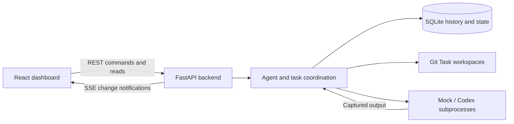

# AI Agent Control Center

A local workspace for supervising AI coding agents: see what is running, follow output, answer questions, and intervene without juggling separate terminal sessions.

**Active work in progress.** Stage 2 development is building durable task ownership, isolated workspaces, and coordination beneath the dashboard. The long-term goal is to help people manage related work across multiple agents; autonomous planning and multi-provider orchestration are not implemented yet.

> **Local use only:** the backend currently has no authentication. Do not expose it to untrusted networks or operate it as a production-ready hosted service. Task prompts, agent output, and workspace metadata can contain private information.

## What works today

### In the dashboard

- Start Mock or Codex agents; choose `read-only` (default) or `workspace-write` for Codex. Mock agents simulate progress and do not execute the supplied task.
- Follow live status through Server-Sent Events (SSE), with polling fallback, and browse paginated output history.
- Stop an agent or an existing agent subtree, reply to waiting Codex agents, redirect a running session, or respond to explicit agent decision requests.
- Navigate existing parent/child relationships; search and filter by status and color; edit agent names and inspect name history.
- Use an attention panel, light/dark/system themes, a resizable inspector, and opt-in browser/Windows notifications.
- Retain agent metadata and output in SQLite across backend restarts. Recovery does not automatically restart workers.

### Backend foundations

| Capability | Current scope |
| --- | --- |
| Durable Tasks and assignments | Work identity survives worker replacement; explicit child creation is available through the API. |
| Projects and Task workspaces | Canonical Project roots, per-Task Git worktrees, freshness checks, and explicit conflict-aware integration. |
| Lifecycle and dependencies | Pause/resume/cancel, subtree impact, dependency validation, and durable blockers. |
| Resource coordination | Managed claims, fair queues, deadlock detection, port preflight, and bounded controller reservations. |
| Logical work intents | Explicit responsibility scopes, hierarchical overlap detection, and conflict inspection. |
| Delegation requests | Durable provenance, opt-in structured Codex requests, and atomic Parent handoff; no automatic Child creation or execution. |

These foundations have API endpoints but no dedicated Project, Task-lifecycle, integration, resource, or work-intent editors in the current UI. The dashboard uses workspaces when launching agents; it does not yet provide an orchestration interface.

## Architecture



The frontend uses **React 19, JavaScript, Vite 8, and CSS**. The backend uses **Python, FastAPI, Uvicorn, SQLite, and standard-library process/thread management**. Git provides source snapshots and linked worktrees. Agents, Tasks, and Projects have separate identities; an assignment connects a worker to durable work.

Run one backend process/worker: process registries, locks, and live-event state are process-local. See the [technical documentation](#technical-documentation) for persistence, recovery, and coordination invariants.

## Run locally on Windows

### Prerequisites

- Git on `PATH`. Use a Git clone with an existing commit, not a downloaded ZIP: starting either agent type requires a valid Git repository for Task workspaces.
- Python 3.11 or newer, available as `python`.
- Node.js 24+ with npm, or Node.js 22.13+ within the 22.x line.
- For real Codex agents: an installed, configured, authenticated Codex CLI at `%APPDATA%\npm\codex.cmd`. The backend currently launches Codex through this Windows npm launcher. Mock mode needs no Codex account.

### Install

In a **setup PowerShell window**, open the parent directory where you want the clone, then run:

```powershell
git clone https://github.com/amit22882036-ship-it/ai-agent-control-center.git
cd .\ai-agent-control-center
python -m venv .venv
.\.venv\Scripts\python.exe -m pip install -r backend/requirements.txt
cd .\frontend
npm ci
```

For an existing clone, skip cloning and begin from its repository root. The commands use the virtual environment directly; activation is not required. Backend dependencies are currently unpinned, while `npm ci` uses the frontend lockfile.

### Start both components

Open two separate PowerShell windows **in the parent directory containing your `ai-agent-control-center` clone**.

**Backend PowerShell window:**

```powershell
cd .\ai-agent-control-center\backend
..\.venv\Scripts\python.exe -m uvicorn app.main:app --host 127.0.0.1 --port 8000 --reload
```

**Frontend PowerShell window:**

```powershell
cd .\ai-agent-control-center\frontend
npm run dev -- --host 127.0.0.1 --port 5173 --strictPort
```

Keep both windows running. Open the [dashboard](http://127.0.0.1:5173), check [backend health](http://127.0.0.1:8000/health), or inspect the [local API documentation](http://127.0.0.1:8000/docs). These links point to your machine, not a hosted demo. The frontend targets port 8000; CORS permits frontend origins `localhost:5173` and `127.0.0.1:5173`.

Choose **New agent**, select **Mock**, and enter a sample assignment to explore the UI. Mock runs simulate progress only. Codex runs use the authenticated CLI and the selected sandbox mode.

### Local state

SQLite state lives in ignored `data/control_center.sqlite3`; `CONTROL_CENTER_DB_PATH` can override its location. Task workspaces default to `%LOCALAPPDATA%/AI Agent Control Center/task-workspaces`; `CONTROL_CENTER_WORKSPACE_ROOT` can select an external directory that does not overlap a Project. Workspaces and history are retained after workers stop. Do not commit private runtime state or manually move active worktrees. See [workspace details](docs/workspaces.md).

## Development checks

In a **verification PowerShell window**, open the repository root, then run:

```powershell
cd .\backend
..\.venv\Scripts\python.exe -B -m unittest discover -s . -p "test_*.py" -v
cd ..\frontend
node --test tests/*.test.mjs
npm run lint
npm run build
npm audit
cd ..
git diff --check
git status
```

Backend tests cover lifecycle, persistence, coordination, and workspace behavior with mocks and temporary repositories. Frontend tests use Node's built-in test runner. These commands do not establish that a live Codex workflow works end to end; relevant behavior changes also need deliberate interactive verification. A successful dependency audit is not a guarantee of application security.

## Current limitations

- Windows is the supported real-agent launch target; Codex is the only implemented real provider. Other operating systems are not a verified end-to-end target.
- There is no authentication, multi-user isolation, or production deployment configuration.
- Coordination covers managed work, not every process on the machine. Port reservations are released before worker use; actual worker ownership is unverified and a race remains.
- Git worktrees share repository history. Snapshots exclude common secret/build paths by filename, but are not secret scanners or complete isolation boundaries. Symlinks and submodules are unsupported for Task snapshots.
- Worker status does not independently verify task correctness. Restart recovery restores durable records without reattaching unknown surviving OS processes.
- Automatic task decomposition, scheduling, semantic duplicate-work detection, additional providers, and richer Task/Project UI remain future work. They are not current product capabilities.

## Technical documentation

- [Tasks, lifecycle, and dependencies](docs/task-lifecycle.md) — work identity, controls, blockers, and recovery.
- [Delegations and request protocol](docs/delegations.md) — request provenance, opt-in Codex JSONL, atomic Parent handoff, and recovery.
- [Projects, workspaces, and integration](docs/workspaces.md) — snapshots, staleness, conflict handling, and canonical-file protection.
- [Resource coordination and work intents](docs/resource-coordination.md) — fairness, deadlocks, runtime evidence, and responsibility scopes.
- [AGENTS.md](AGENTS.md) — repository-wide security, documentation, and development rules for Codex.
